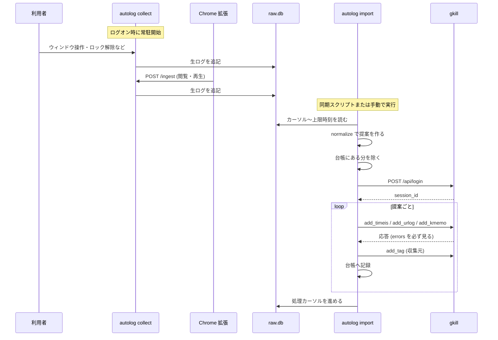
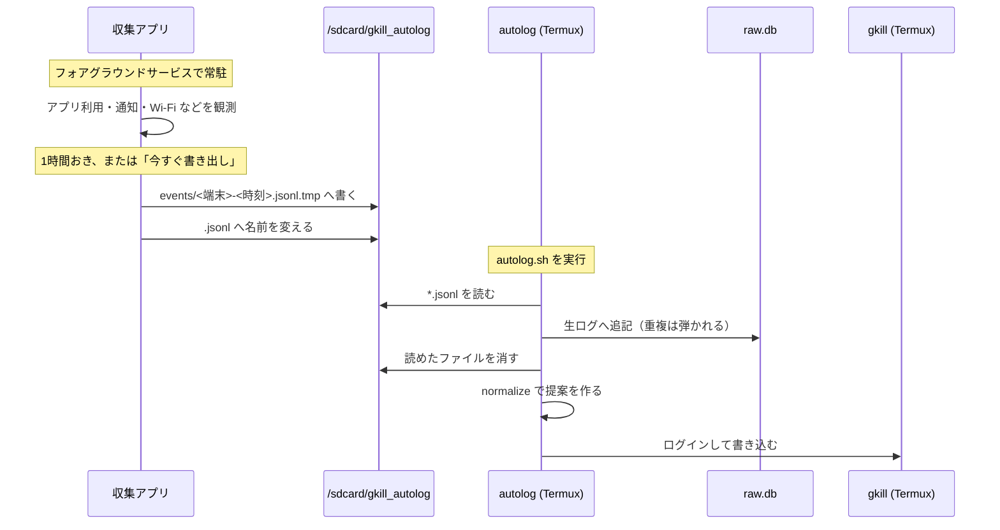
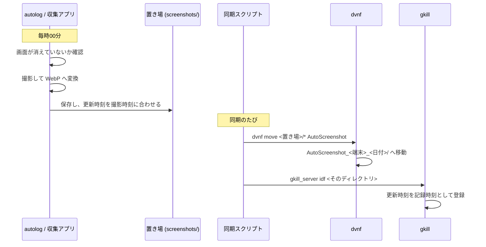
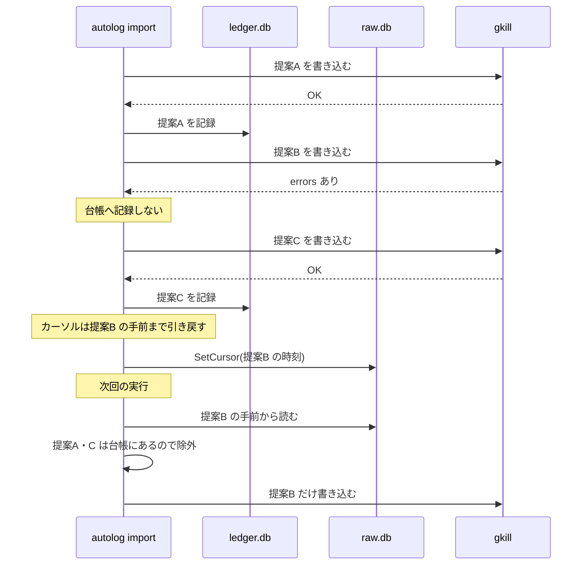
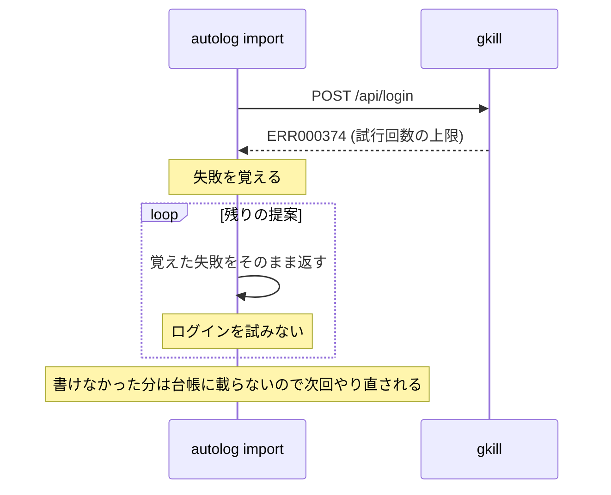

# シーケンス図

主要な処理の流れです。用語は [glossary.md](glossary.md) を参照してください。

## 1. PC で集めて取り込む

## 2. Android で集めて取り込む

収集アプリと `autolog` は別のアプリなので、共有ストレージ経由で受け渡します。

書きかけを読まれないよう `.tmp` に書いてから名前を変えます。
`autolog` は `.jsonl` だけを読みます。

## 3. スクリーンショット

autolog は撮って置くだけで、gkill へは入れません。

更新時刻を撮影時刻に合わせないと、取り込んだ日時で記録されてしまいます。

## 4. 失敗したときの巻き戻し

1件の失敗で全体を止めません。失敗した分だけが次回に回ります。

## 5. ログインに失敗したとき

gkill のログインは IP ごとに 15 分で 10 回までです。
提案ごとに再試行すると、上限をさらに使い潰して復帰を遅らせます。
