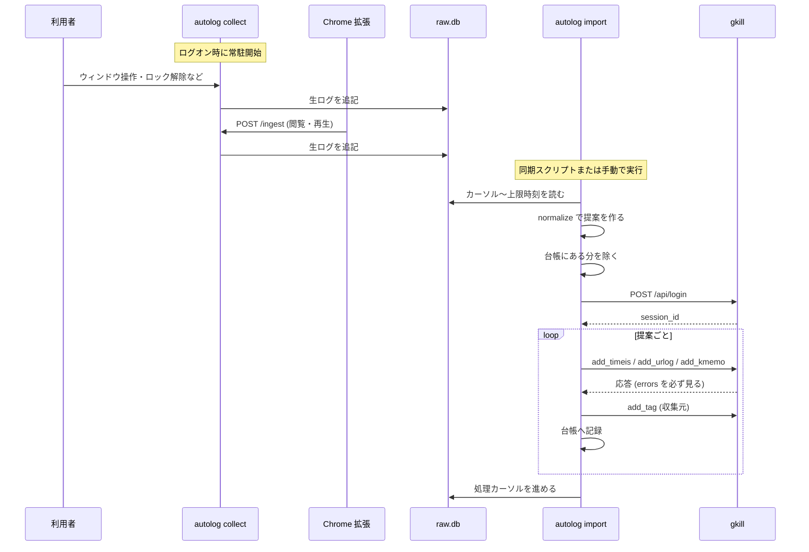
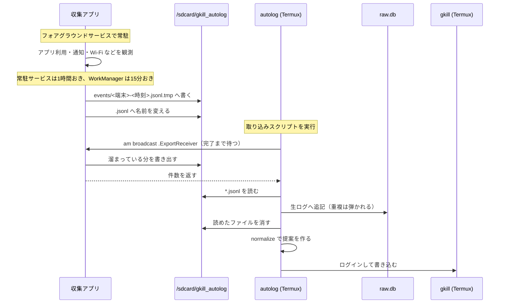
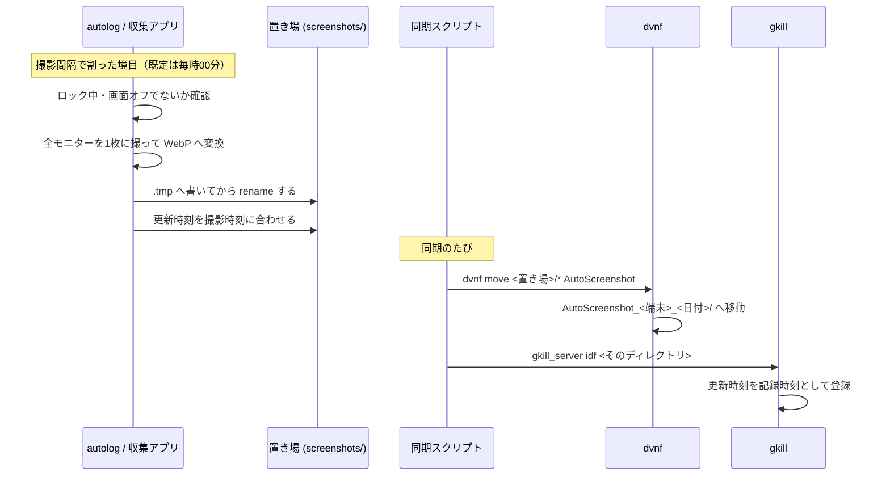
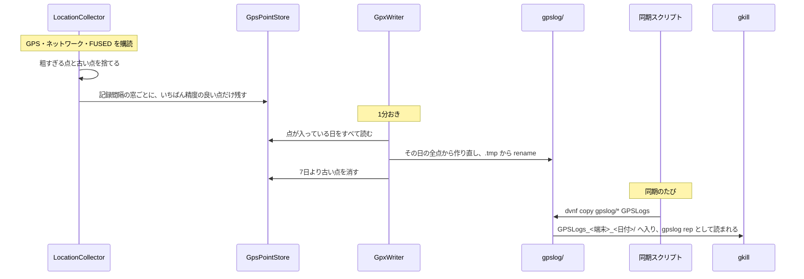
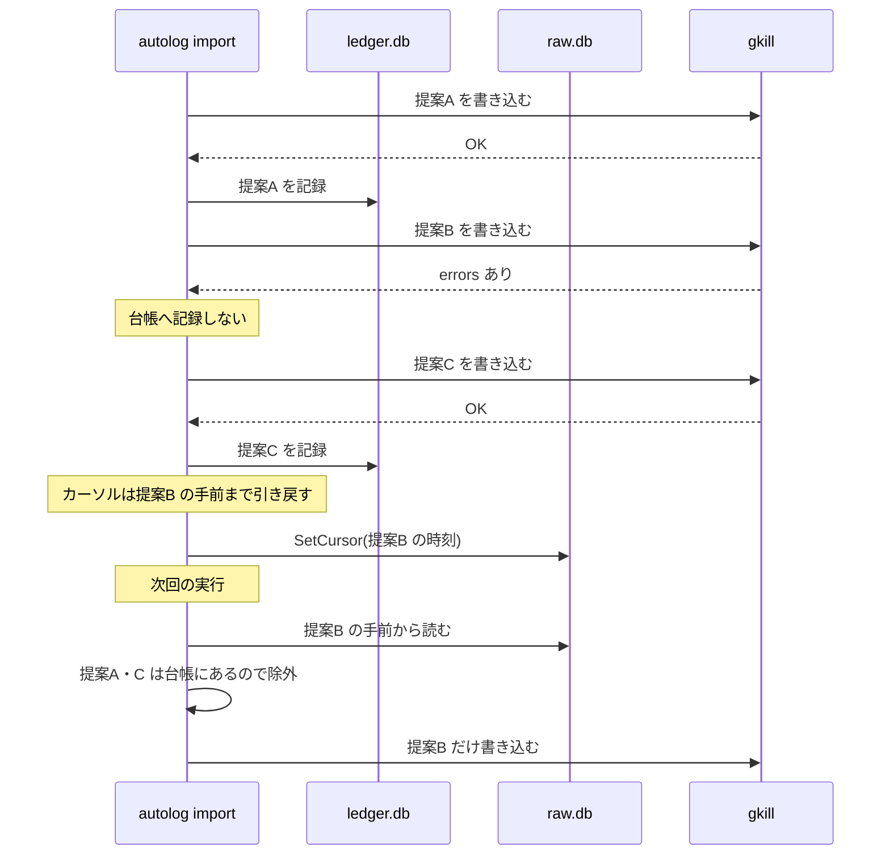
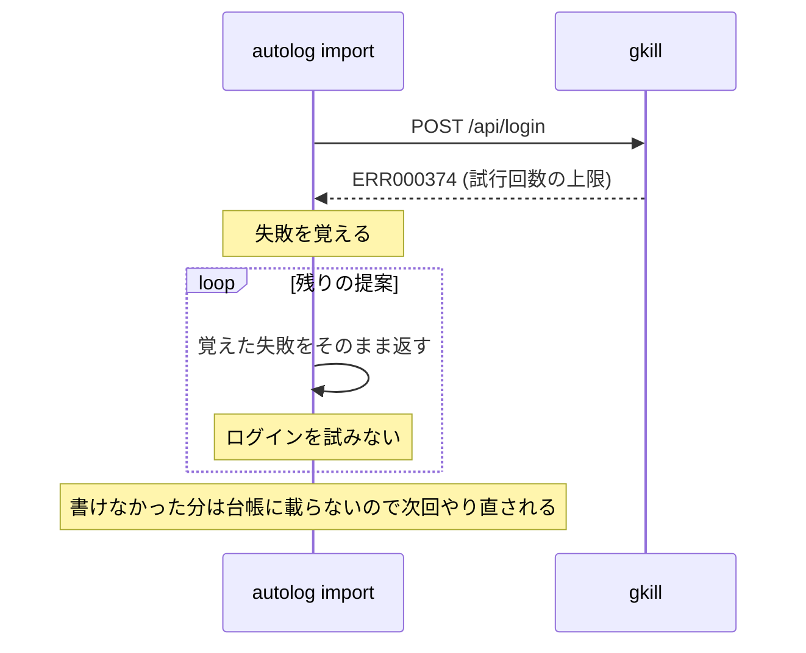

# シーケンス図

主要な処理の流れです。用語は [glossary.md](glossary.md) を参照してください。

## 1. PC で集めて取り込む

## 2. Android で集めて取り込む

収集アプリと `autolog` は別のアプリなので、共有ストレージ経由で受け渡します。

**取り込みの前に書き出しを要求します。** これが無いと、アプリ内に溜まっている
直近の記録が共有ディレクトリに出ないまま取り込みが走ります。

書きかけを読まれないよう `.tmp` に書いてから名前を変えます。
`autolog` は `.jsonl` だけを読みます。

## 3. スクリーンショット

autolog は撮って置くだけで、gkill へは入れません。

`.tmp` を経由するのは、`idf` が書きかけのファイルを拾わないようにするためです。
更新時刻を撮影時刻に合わせないと、取り込んだ日時で記録されてしまいます。

撮り逃した時間の画像は後から作りません。ただし Android だけは、
撮り逃した最後の1区切りを次に画面が点いた時点で撮ります。
このとき記録するのは**実際に撮れた時刻**で、区切りの時刻ではありません。

## 4. 位置情報 (Android)

生ログを経由しません。GPX が最終形で、`autolog import` は関与しません。

毎回作り直すのは、GPX に閉じタグが要るからです。
そのため**この DB を作り直す移行をしてはいけません。**
点を消すと、次の書き出しで当日分の軌跡が短くなって消えます。

## 5. 失敗したときの巻き戻し

1件の失敗で全体を止めません。失敗した分だけが次回に回ります。

## 6. ログインに失敗したとき

gkill のログインは IP ごとに 15 分で 10 回までです。
提案ごとに再試行すると、上限をさらに使い潰して復帰を遅らせます。
